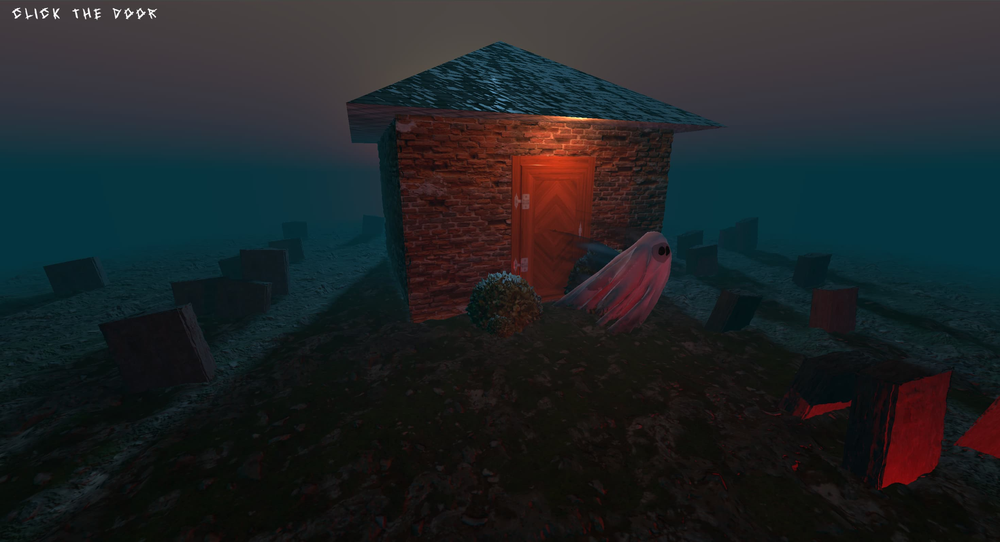

# Haunted House with Interactive Ghost Model

Welcome to the **Haunted House with Interactive Ghost Model** project! This is an immersive web-based 3D visualization built using Three.js, featuring a spooky haunted house scene with a ghost model that responds to user interactions. The project leverages GSAP for smooth animations, WebGL for rendering, and Web Audio API for dynamic sound effects, creating an engaging experience with restricted camera controls and interactive model manipulation.

## Preview



## Features

- **Interactive Ghost Model**: A 3D ghost model toggles position (`z = 1` to `z = 3`) on door clicks and rotates smoothly left/right via buttons.
- **Restricted OrbitControls**: Camera rotation limited to horizontal (Y-axis) movement, with zoom and vertical rotation disabled.
- **GSAP Animations**: Smooth position and rotation animations for the ghost model using the GreenSock Animation Platform.
- **Dual Audio System**: Plays `haunted.mp3` for ambient effects (via "Enter" button) and `boo.mp3` for door interactions, with audio-driven light intensity.
- **Dynamic Lighting**: Point lights (door and ghosts) adjust intensity based on `haunted.mp3` audio frequencies.
- **Raycasting**: Detects door clicks to trigger ghost movement and sound playback.
- **GUI Debugging**: lil-gui interface for adjusting ghost position and rotation.

## Prerequisites

- **Node.js**: v20.x (LTS) or later (tested with v22.17.0).
- **npm**: Included with Node.js.
- **Web Browser**: Modern browsers like Chrome, Firefox, or Edge.
- **Local Server**: Required for loading assets (e.g., `python -m http.server` or Vite).

## Installation

1. **Clone the Repository**
   ```bash
   git clone https://github.com/HarshitKumarSahu/haunted-house
   cd haunted-house-threejs
   ```

2. **Install Dependencies**
   ```bash
   npm install
   ```
   This installs Three.js, GSAP, lil-gui, and other dependencies listed in `package.json`.

3. **Set Up Assets**
   - Place the 3D model (`ghost.glb`) in the `./model/` directory.
   - Ensure Draco decoder files are in the `./draco/` directory (download from Three.js or include via CDN).
   - Place audio files (`haunted.mp3` and `boo.mp3`) in the `./sounds/` directory.
   - Ensure texture files (for floor, walls, roof, door, bushes, graves) are in their respective directories (`./floor/`, `./wall/`, etc.).

4. **Run the Project Locally**
   - Start a local server:
     ```bash
     npm run dev
     ```
     Or use a simple server:
     ```bash
     python -m http.server 8000
     ```
   - Open your browser at `http://localhost:8000` (or the specified port).

5. **Build for Production**
   - Build the project:
     ```bash
     npm run build
     ```
   - Serve the `dist` folder using a static server or deploy to a platform like Vercel.

## Usage

- **Interact with the Scene**:
  - Drag the mouse left/right to rotate the camera horizontally around the scene.
  - Click the house door to toggle the ghost model between `z = 1` and `z = 3`, playing `boo.mp3`. The ghost returns to `z = 1` when the sound ends.
  - Click "Rotate Left" or "Rotate Right" to rotate the ghost model 90 degrees smoothly.
  - Click the "Enter" button to play `haunted.mp3`, affecting light intensity.
- **Debugging**:
  - Use the lil-gui interface to adjust the ghost’s `z` position and `y` rotation manually.

## Dependencies

- **Three.js**: For 3D rendering, scene management, and WebGL.
- **GSAP**: For smooth position and rotation animations (included via CDN).
- **lil-gui**: For debugging GUI (included via CDN).
- **GLTFLoader & DRACOLoader**: For loading compressed 3D models.
- **Web Audio API**: For audio playback and analysis.

## Customization

- **Textures**: Replace textures in `./floor/`, `./wall/`, `./roof/`, `./door/`, `./bush/`, and `./grave/` to change the scene’s appearance.
- **Model**: Swap `ghost.glb` with another `.glb` file in `./model/` to use a different 3D model.
- **Animations**: Modify GSAP parameters in `script.js` (e.g., `duration`, `ease`) for position (`z`) or rotation (`y`) animations.
- **Audio**: Replace `haunted.mp3` or `boo.mp3` in `./sounds/` with different audio files.
- **Controls**: Adjust `OrbitControls` settings (e.g., `dampingFactor`) or rotation angles in `script.js`.
- **Styles**: Edit `style.css` to customize button appearance or layout.

## Acknowledgments

- Inspired by Three.js Journey tutorials and haunted house scene examples.
- Thanks to the open-source community for tools like Three.js, GSAP, and Draco compression.